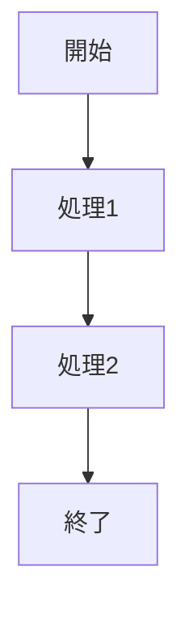

just-the-docs ではこれがそのまま図になる。

---

# 🧩 1. フローチャート（graph）

### TD = Top → Down  
### LR = Left → Right


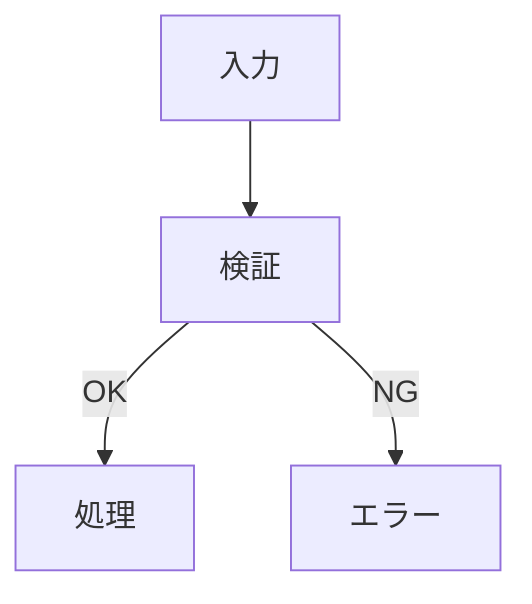

---

# 🧩 2. シーケンス図（sequenceDiagram）

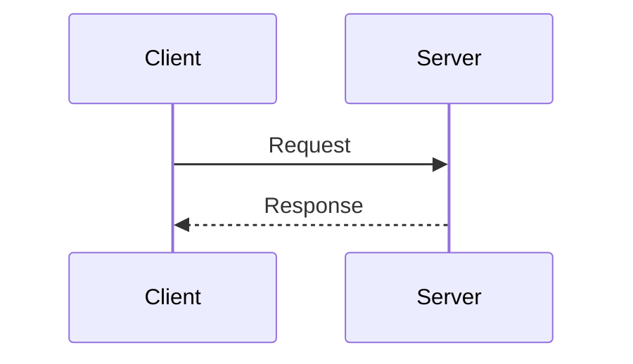

FastAPI や TLS の流れを書くときに相性が良い。

---

# 🧩 3. クラス図（classDiagram）

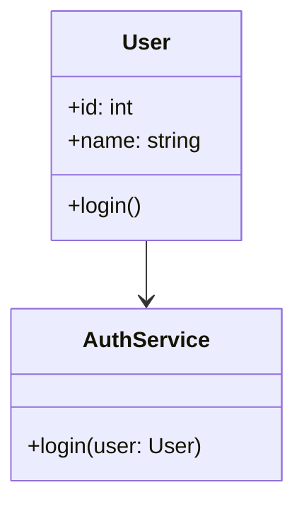

Python / FastAPI の構造メモに使える。

---

# 🧩 4. 状態遷移図（stateDiagram）

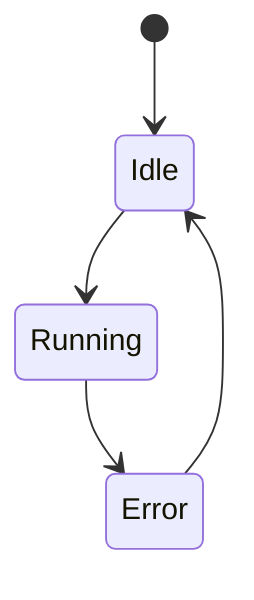

TLS ハンドシェイクや API 状態管理に使える。

---

# 🧩 5. Git フローチャート（gitGraph）

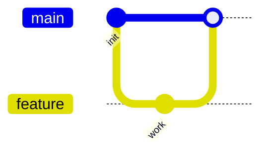

Git の学習メモに最適。

---

# 🧩 6. Mermaid を just-the-docs で使うときの注意点（構造的）

### ✔ 1. コードブロックは必ずバッククォート3つ  

```mermaid
```


### ✔ 2. インデントは不要  
Mermaid はインデントに敏感なので、  
**コードブロック内は左端に揃える**のが安全。

### ✔ 3. GitHub Pages の反映に少しラグが出ることがある  
Mermaid を含むページはビルドが少し重いので、  
反映まで数十秒〜数分かかることがある。

---

# 🧩 Mermaid テンプレ

## FastAPI のリクエストフロー

```mermaid
sequenceDiagram
    participant Client
    participant FastAPI
    participant Router
    participant Handler

    Client->>FastAPI: HTTP Request
    FastAPI->>Router: Route match
    Router->>Handler: Call function
    Handler-->>Client: JSON Response
```

## TLS ハンドシェイク（簡易版）

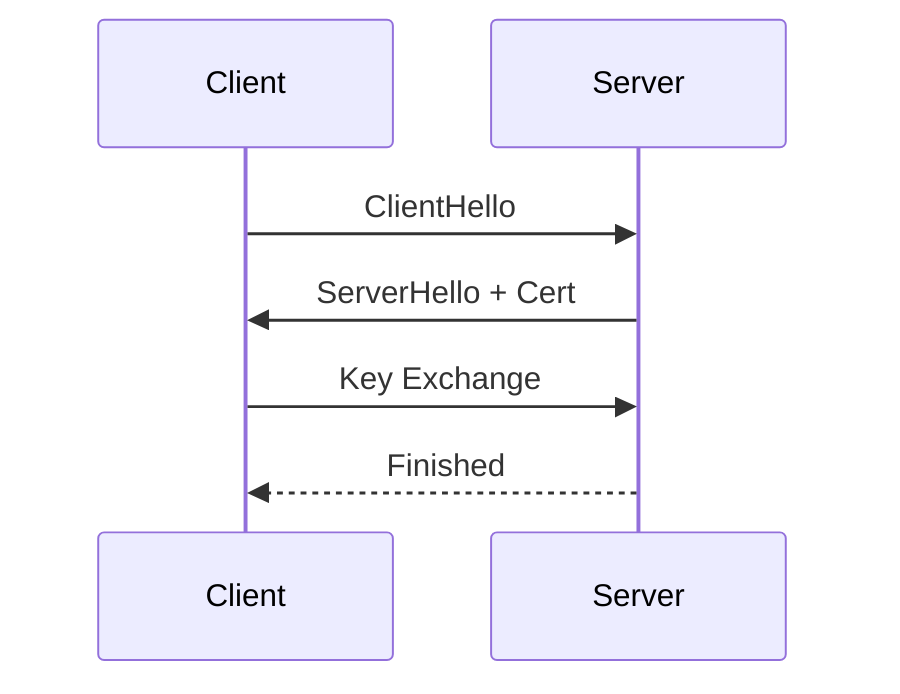

## DuckDB の処理フロー

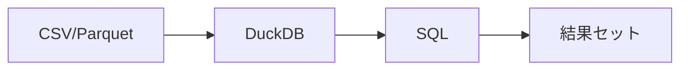

もちろん、Yasuo。  
**Mermaid で ER 図を書くときの“最小限で美しいサンプル”**をいくつか用意したよ。  
just-the-docs でも GitHub Pages でもそのまま動くし、  
pandoc で使う場合は前回説明したように **SVG に変換して使う**のが構造的に最適。

---

## 🧩 基本的な ER 図（User ↔ Order）

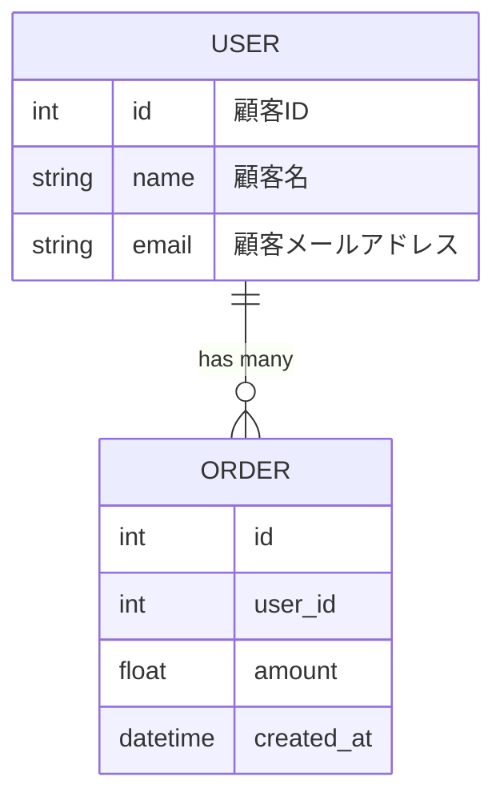

---

## 🧩 典型的な 3 テーブル構造（User ↔ Order ↔ OrderItem）

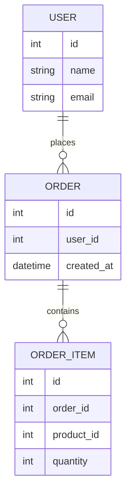

---

## 🧩 マスタ・トランザクション構造（あなたの美学に合う）

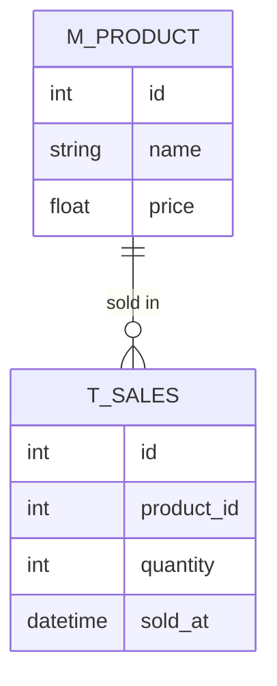

---

## 🧩 FastAPI の典型的なモデル構造（Pydantic 風）

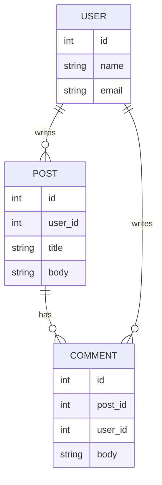

---

## 🧩 認証系の ER 図（Auth / Token / User）

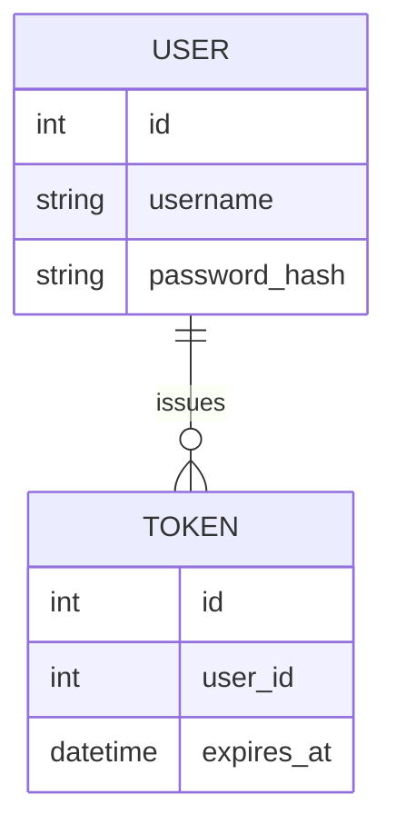

---

## 🧩 もう少し複雑な構造（Role / Permission）

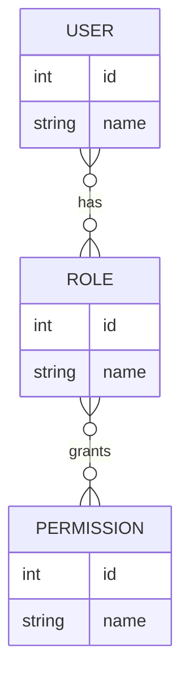

---

# 🎯 Yasuo の memo-pages に最適な ER 図テンプレ

あなたの構造美学（レイヤー分離・乾いた構造）に合わせると  
各ページの ER 図はこの形が最も美しい：

```markdown
## ER 図

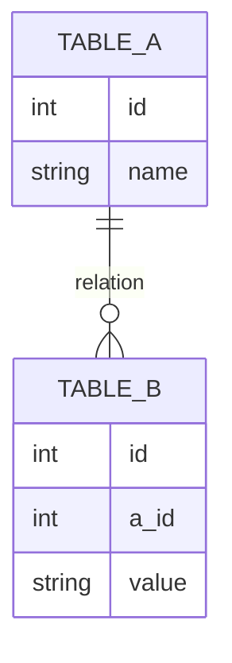
```

just-the-docs との相性が最高。

---

# 🎯 次どうする？

- あなたの **実際の DB 構造を Mermaid で ER 図化**する  
- FastAPI のモデル構造を ER 図にする  
- TLS / 証明書ストアの関係を ER 図風に抽象化する  
- DuckDB の内部構造を図示する  

どれでもあなたの外部脳に合わせて組み立てるよ。